# 03-analysis-plan


# Anticipated data analysis

In this document, we will formalise the sttistical analysis that we
intend to do using the data we collect. We will go through each of the
three experiments, specify the null and alternative hypotheses and run
the analysis on a simulated dataset. We intend to re-use this code when
analysing the experimental data.

``` r
# load relevant libraries
library(ggplot2)
```

## Experiment 1:

For experiment 1, the Directed Acyclic Graph representing the causal
structure in the experiment. Specifically, the biomass of native plants
(L) after 8-weeks of growth as a function of experimental nitrogen-level
(N) and the presence or absence of soil microbes (M).

``` r
dag1 <- dagitty::dagitty(x = 'dag {
bb="0,0,1,1"
L [pos="0.28,0.29"]
M [pos="0.215,0.200"]
N [pos="0.35,0.200"]
M -> L
N -> L
}'
)
plot(dag1)
```

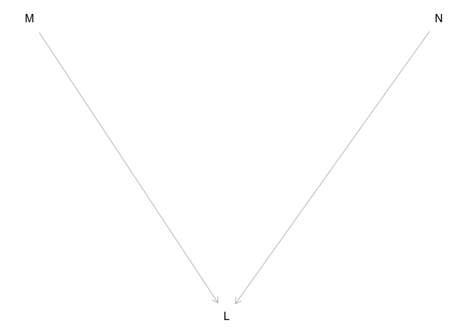

We hypothesise that plant-soil feedback becomes stronger (i.e. has a
stronger negative effect on plant biomass) with increasing nitrogen.
Based on this experimental design, we will use the following linear
model to analyse this experiment:

 = \alpha + \beta_1\text{N}_{i} + \beta_2\text{M}_{i} + \beta_3\text{N}_{i}\text{M}_{i} + \epsilon_{i}")

")

Based on this model, we can set-up the statistical hypotheses as
follows:


Therefore, if  is significantly less than
zero (i.e. ), we would
interpret this as evidence that plant-soil feedback does become stronger
with increasing N.

### Simulated data

To design write the code used to perform the above hypothesis tests, we
will simulate data that is consistent with this experiment (i.e. the
data that we expect to obtain).

``` r
# the exact values of the parameters are not that important in this case
n_rep = 8
sigma_residual = 0.10
N_lev = log(c(4, 8, 16, 32, 64))
M_lev = c(0, 1)
alpha = 4.5
beta1 = 0.2
beta2 = -0.12
beta3 = -0.1

# simulate nitrogen values
N <- rep(rep(N_lev, each = n_rep), length(M_lev))
  
# simulate microbe presence-absence
M <- rep(M_lev, each = length(N_lev) * n_rep)
  
# simulate the expected log plant biomass
mu <- (beta1 * (N - min(N))) + (beta2 * M) + (beta3 * (N - min(N)) * M)
  
# transform back from log-scale and apply alpha
Y <- alpha * exp(mu + rnorm(n = length(N), mean = 0, sd = sigma_residual))
  
# return the simulated data as a data frame
dat_e1 <- dplyr::tibble("N" = N, "M" = M, "L" = Y)
```

### Data analysis

In addition to the standard data cleaning and exploratory data analysis
procedures that must occur in any data-driven scientific project, there
are two important transformations that need to be done for the analysis.
First, we will substract the minimum nitrogen-level (log-scale) so that
the lowest nitrogen-level in the model and, therefore, the intercept
term represents the expected plant biomass at the lowest-level of
nitrogen without microbes. Additionally, we will need to log-transform
the plant biomass variable.

``` r
# data transformations

# translate nitrogen by the minimum
dat_e1$N_trans <- with(dat_e1, N - min(N))

# log-transform plant biomass
dat_e1$L_log <- log(dat_e1$L)

# check the data
head(dat_e1)
```

    # A tibble: 6 × 5
          N     M     L N_trans L_log
      <dbl> <dbl> <dbl>   <dbl> <dbl>
    1  1.39     0  4.02       0  1.39
    2  1.39     0  4.81       0  1.57
    3  1.39     0  5.21       0  1.65
    4  1.39     0  4.24       0  1.45
    5  1.39     0  4.16       0  1.43
    6  1.39     0  5.02       0  1.61

Now we are ready to fit the model:

``` r
# fit the statistical model
lm_e1 <- lm(L_log ~ M + N_trans + M:N_trans, data = dat_e1)
```

Prior to interpreting the results, we need to check the model
assumptions. We will do this using a graphical analysis of the
residuals. Specifically, we will check that the distribution of the
model residuals are at least approximately normal:

``` r
# check for residual normality
lm_e1_res <- residuals(lm_e1)

# plot a qqplot of the residuals
qqnorm(lm_e1_res, main = "Residual Q-Q Plot")
qqline(lm_e1_res, col = "red")
```

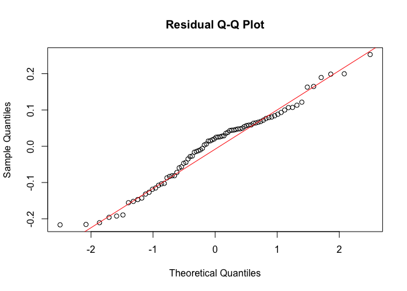

Next, we will test the homogeneity of variance assumption by examining a
plot of the residuals versus the fitted values. There should be no
pattern in the data:

``` r
# plot residuals vs fitted values
plot(lm_e1$fitted.values, residuals(lm_e1), 
     xlab = "Fitted Values", 
     ylab = "Residuals", 
     main = "Residuals vs Fitted Values",
     pch = 20, col = "blue")

# add a horizontal line at 0 for reference
abline(h = 0, col = "red", lty = 2)
```

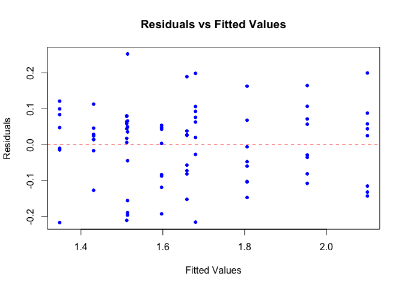

If these assumptions are met as indicated by the graphs above (although
whether the assumptions are met will always be a judgement call), we can
then examine the results and evaluate our hypothesis:

``` r
# check the model summary
summary(lm_e1)
```


    Call:
    lm(formula = L_log ~ M + N_trans + M:N_trans, data = dat_e1)

    Residuals:
          Min        1Q    Median        3Q       Max 
    -0.305161 -0.063319  0.000386  0.070744  0.237251 

    Coefficients:
                Estimate Std. Error t value Pr(>|t|)    
    (Intercept)  1.52973    0.02958  51.709  < 2e-16 ***
    M           -0.16738    0.04184  -4.001 0.000145 ***
    N_trans      0.19906    0.01742  11.424  < 2e-16 ***
    M:N_trans   -0.09175    0.02464  -3.723 0.000375 ***
    ---
    Signif. codes:  0 '***' 0.001 '**' 0.01 '*' 0.05 '.' 0.1 ' ' 1

    Residual standard error: 0.108 on 76 degrees of freedom
    Multiple R-squared:  0.8067,    Adjusted R-squared:  0.7991 
    F-statistic: 105.7 on 3 and 76 DF,  p-value: < 2.2e-16

In this output, the  parameter is the
“M:N_trans” parameter. This output indicates that
 is significantly less than zero
().
Therefore, we would reject our null hypothesis
()
and infer support for our alternative hypothesis
().

### Visualise the results

To visualise the results, we will plot the model against the raw data.
In addition, we will calculate plant-soil feedback using the metric used
by Goossens et al. (2023, npj):


In this equation, the 
is the average across replicates of plant biomass for a given nitrogen
level. Therefore, to obtain a measurement of the error around this
estimate for each level of nitrogen, we used bootstrapping.

``` r
# function for bootstrapping the sample and estimating psf
bootstrap_psf <- function(data, n, resp = "L") {
  # bootstrap the psf estimates n times
  resampled_psf <- lapply(1:n, function(i) {
    # make a y-variable
    data$Y <- data[[resp]]
    # get bootstrap indices
    indices <- sample(seq_len(nrow(data)), replace = TRUE)
    # extract the re-sampled data
    resample_i <- data[indices, ]
    # calculate psf
    suppressMessages(
      resample_i_wide <-
      resample_i |>
      dplyr::group_by(N, M) |>
      dplyr::summarise(Y_m = mean(Y, na.rm = TRUE)) |>
      tidyr::pivot_wider(id_cols = "N",
                         names_from = "M",
                         values_from = "Y_m")
      )
    names(resample_i_wide) <- c("N", "M_abs", "M_pres")
   # calculate plant-soil feedback
   resample_i_wide$psf <- with(resample_i_wide, (M_pres-M_abs)/M_abs)
   # return the re-sampled data
   return(resample_i_wide)
  })
  # return the output
  return(dplyr::bind_rows(resampled_psf, .id = "bootstrap_i"))
}
```

Plot the model results along with the bootstrapped plant-soil feedback
metrics:

``` r
# log-scale

# get model predictions
pred_e1 <- dplyr::as_tibble(predict(lm_e1, interval = "confidence"))

# add the fit statistics to the data
plot_e1 <-
  dat_e1 |>
  dplyr::mutate(fit = pred_e1$fit,
                lwr = pred_e1$lwr,
                upr = pred_e1$upr)

# plot the data on the log-scale
p1 <-
  ggplot(data = plot_e1 |> dplyr::mutate(M = as.character(M))) +
  geom_point(mapping = aes(x = N, y = L_log, colour = M)) +
  geom_line(mapping = aes(x = N, y = fit, colour = M)) +
  geom_ribbon(mapping = aes(x = N, ymin = lwr, ymax = upr, fill = M), alpha = 0.1) +
  ylab("Native biomass (mg) (log-scale)") +
  xlab("log(N)") +
  theme_bw()

# calculate plant soil feedback metric

# bootstrapped
psf_e1_boot <- bootstrap_psf(data = dat_e1, n = 1000, resp = "L")

# summarise these bootstrapped samples
psf_e1_boot <-
  psf_e1_boot |>
  dplyr::group_by(N) |>
  dplyr::summarise(psf_mean = mean(psf, na.rm = TRUE),
                   psf_sd = sd(psf, na.rm = TRUE), .groups = "drop")

# plot the change
p2 <-
  ggplot(data = psf_e1_boot,
       mapping = aes(x = N, y = psf_mean)) +
  geom_point() +
  geom_errorbar(mapping = aes(ymin = psf_mean - psf_sd,
                              ymax = psf_mean + psf_sd),
                width = 0) +
  ylab("Plant-soil feedback") +
  xlab("log(N)") +
  theme_bw()

cowplot::plot_grid(p1, p2, nrow = 1, rel_widths = c(1.3, 1))
```

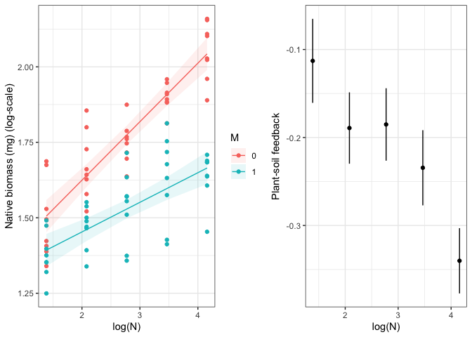

## Experiment 2:

The analysis for experiment 2 is very similar to that for experiment 1.
The causal structure, represented by the Directed Acyclic Graph, models
the biomass of invasive plants (I) after 8-weeks of growh as a function
of experimental nitrogen-level (N) and the presence or absence of soil
microbes (M).

``` r
dag2 <- dagitty::dagitty(x = 'dag {
bb="0,0,1,1"
I [pos="0.28,0.29"]
M [pos="0.215,0.200"]
N [pos="0.35,0.200"]
M -> I
N -> I
}'
)
plot(dag2)
```

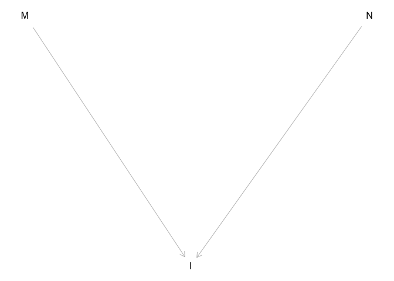

We hypothesise that plant-soil feedback does not change or becomes
weaker (i.e. has a weaker negative effect on plant biomass) with
increasing nitrogen for invasive species. Based on this experimental
design, we will use the following linear model to analyse this
experiment:

 = \alpha + \beta_1\text{N}_{i} + \beta_2\text{M}_{i} + \beta_3\text{N}_{i}\text{M}_{i} + \epsilon_{i}")

")

Based on this model, we can set-up the statistical hypotheses as
follows. The null hypothesis is that plant-soil feedback does not change
or becomes weaker:


The alternative hypothesis is that plant-soil feedback becomes stronger.


Therefore, if  is significantly less than
zero (i.e. ), we would
interpret this as evidence that plant-soil feedback does become stronger
with increasing N. However, if  is not
significantly less than zero
(i.e. ), then we cannot
reject the null hypothesis and we infer that nitrogen does not modify
the strength of plant-soil feedback in invasive species.

### Simulated data

We will simulate data that is consistent with this experiment (i.e. the
data that we expect to obtain).

``` r
# the exact values of the parameters are not that important in this case
n_rep = 8
sigma_residual = 0.10
N_lev = log(c(4, 8, 16, 32, 64))
M_lev = c(0, 1)
alpha = 4.5
beta1 = 0.2
beta2 = -0.12
beta3 = 0

# simulate nitrogen values
N <- rep(rep(N_lev, each = n_rep), length(M_lev))
  
# simulate microbe presence-absence
M <- rep(M_lev, each = length(N_lev) * n_rep)
  
# simulate the expected log plant biomass
mu <- (beta1 * (N - min(N))) + (beta2 * M) + (beta3 * (N - min(N)) * M)
  
# transform back from log-scale and apply alpha
Y <- alpha * exp(mu + rnorm(n = length(N), mean = 0, sd = sigma_residual))
  
# return the simulated data as a data frame
dat_e2 <- dplyr::tibble("N" = N, "M" = M, "I" = Y)
```

### Data analysis

As with experiment 1, we will substract the minimum nitrogen-level
(log-scale) so that the lowest nitrogen-level in the model and,
therefore, the intercept term represents the expected plant biomass at
the lowest-level of nitrogen without microbes. Additionally, we will
need to log-transform the plant biomass variable.

``` r
# data transformations

# translate nitrogen by the minimum
dat_e2$N_trans <- with(dat_e2, N - min(N))

# log-transform plant biomass
dat_e2$I_log <- log(dat_e2$I)

# check the data
head(dat_e2)
```

    # A tibble: 6 × 5
          N     M     I N_trans I_log
      <dbl> <dbl> <dbl>   <dbl> <dbl>
    1  1.39     0  4.97       0  1.60
    2  1.39     0  3.91       0  1.36
    3  1.39     0  4.60       0  1.53
    4  1.39     0  6.26       0  1.83
    5  1.39     0  4.39       0  1.48
    6  1.39     0  4.26       0  1.45

Next, we fit the model.

``` r
# fit the statistical model
lm_e2 <- lm(I_log ~ M + N_trans + M:N_trans, data = dat_e2)
```

Check model assumptions using a graphical analysis of the residuals:
Residual normality.

``` r
# check for residual normality
lm_e2_res <- residuals(lm_e2)

# plot a qqplot of the residuals
qqnorm(lm_e2_res, main = "Residual Q-Q Plot")
qqline(lm_e2_res, col = "red")
```


Homogeneity of variance assumption:

``` r
# plot residuals vs fitted values
plot(lm_e2$fitted.values, residuals(lm_e2), 
     xlab = "Fitted Values", 
     ylab = "Residuals", 
     main = "Residuals vs Fitted Values",
     pch = 20, col = "blue")

# add a horizontal line at 0 for reference
abline(h = 0, col = "red", lty = 2)
```

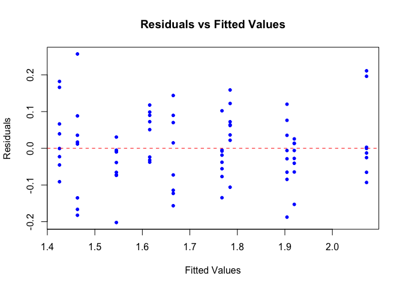

Once the assumptions have been checked and deemed to have been passed,
we can check the model results:

``` r
# check the model summary
summary(lm_e2)
```


    Call:
    lm(formula = I_log ~ M + N_trans + M:N_trans, data = dat_e2)

    Residuals:
         Min       1Q   Median       3Q      Max 
    -0.20024 -0.07048 -0.01057  0.06855  0.33308 

    Coefficients:
                Estimate Std. Error t value Pr(>|t|)    
    (Intercept)  1.50048    0.02999  50.028   <2e-16 ***
    M           -0.07619    0.04242  -1.796   0.0764 .  
    N_trans      0.18799    0.01767  10.642   <2e-16 ***
    M:N_trans   -0.01247    0.02498  -0.499   0.6192    
    ---
    Signif. codes:  0 '***' 0.001 '**' 0.01 '*' 0.05 '.' 0.1 ' ' 1

    Residual standard error: 0.1095 on 76 degrees of freedom
    Multiple R-squared:  0.7488,    Adjusted R-squared:  0.7389 
    F-statistic: 75.51 on 3 and 76 DF,  p-value: < 2.2e-16

The  parameter is the “M:N_trans”
parameter. This output indicates that  is
not significantly less than zero
().
Therefore, we cannot reject the null hypothesis
()
and, therefore, that plant-soil feedback does not become stronger with
nitrogen for invasive species.

### Visualise the results

We will visualise these results in the same way that we visualised the
results for experiment 1 but this time we will, of course, focus on
invasive species biomass.

``` r
# log-scale

# get model predictions
pred_e2 <- dplyr::as_tibble(predict(lm_e2, interval = "confidence"))

# add the fit statistics to the data
plot_e2 <-
  dat_e2 |>
  dplyr::mutate(fit = pred_e2$fit,
                lwr = pred_e2$lwr,
                upr = pred_e2$upr)

# plot the data on the log-scale
p1 <-
  ggplot(data = plot_e2 |> dplyr::mutate(M = as.character(M))) +
  geom_point(mapping = aes(x = N, y = I_log, colour = M)) +
  geom_line(mapping = aes(x = N, y = fit, colour = M)) +
  geom_ribbon(mapping = aes(x = N, ymin = lwr, ymax = upr, fill = M), alpha = 0.1) +
  ylab("Invasive biomass (mg) (log-scale)") +
  xlab("log(N)") +
  theme_bw()

# calculate plant soil feedback metric

# bootstrapped
psf_e2_boot <- bootstrap_psf(data = dat_e2, n = 1000, resp = "I")

# summarise these bootstrapped samples
psf_e2_boot <-
  psf_e2_boot |>
  dplyr::group_by(N) |>
  dplyr::summarise(psf_mean = mean(psf, na.rm = TRUE),
                   psf_sd = sd(psf, na.rm = TRUE), .groups = "drop")

# plot the change
p2 <-
  ggplot(data = psf_e2_boot,
       mapping = aes(x = N, y = psf_mean)) +
  geom_point() +
  geom_errorbar(mapping = aes(ymin = psf_mean - psf_sd,
                              ymax = psf_mean + psf_sd),
                width = 0) +
  ylab("Plant-soil feedback") +
  xlab("log(N)") +
  theme_bw()

cowplot::plot_grid(p1, p2, nrow = 1, rel_widths = c(1.3, 1))
```

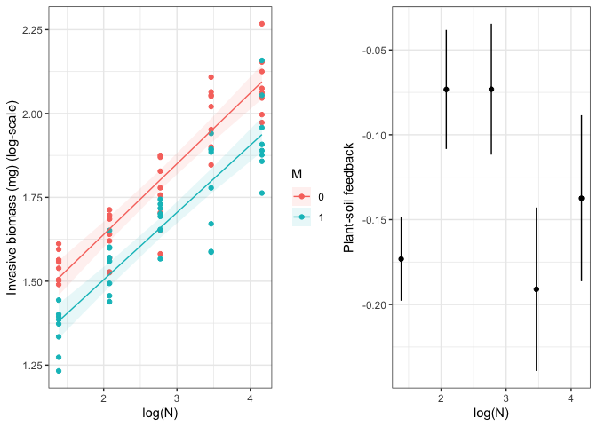

## Experiment 3:

``` r
dag3 <- dagitty::dagitty(x = 'dag {
bb="0,0,1,1"
I [exposure,pos="0.284,0.180"]
L [outcome,pos="0.285,0.300"]
M [pos="0.153,0.180"]
N [pos="0.418,0.180"]
I -> L
M -> L
N -> L
}
'
)
plot(dag3)
```

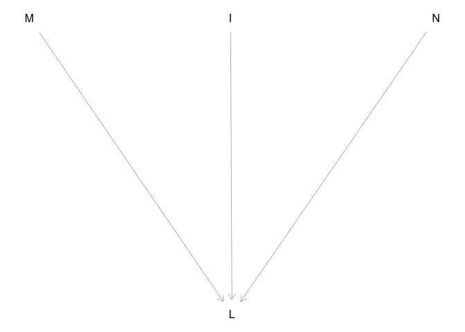

 = \alpha + \beta_1\text{N}_{i} + \beta_2\text{M}_{i} + \beta_3\text{I}_{i} + \beta_4\text{N}_{i}\text{M}_{i} + \beta_5\text{I}_{i}\text{M}_{i} + \beta_6\text{I}_{i}\text{N}_{i} + \beta_7\text{N}_{i}\text{M}_{i}\text{I}_{i} + \epsilon_{i}")

")


The alternative hypothesis is that plant-soil feedback becomes stronger.


### Simulated data

We will simulate data that is consistent with this experiment (i.e. the
data that we expect to obtain).

``` r
# set the number of replicates
n_rep <- 8

# nitrogen-levels
N_lev <- log(c(4, 8, 16, 32, 64))

# soil microbe presence-absence
M_lev <- c(0, 1)

# invasive presence-absence
I_lev <- c(0, 1)

# create a grid of parameters
par_grid <- expand.grid(rep = seq_len(n_rep),
                        N = N_lev, M = M_lev, I = I_lev)

# extract the variables
N <- par_grid[["N"]]
M <- par_grid[["M"]]
I <- par_grid[["I"]]

# set the model parameters

# residual standard deviation
sigma_residual <- 0.05

# alpha - mean plant biomass without microbes on the natural scale
alpha <- 4.5

# beta1 - expected change in mean plant biomass without microbes on the log-scale
beta1 <- 0.10

# beta2 - expected change in mean plant biomass with and without microbes when N is zero without invasives
beta2 <- -0.25

# beta3 - expected change in mean plant biomass with and without invasives when N is zero without microbes
beta3 <- -0.10

# beta4
beta4 <- -0.05

# beta5
beta5 <- 0

# beta6
beta6 <- 0

# beta7
beta7 <- -0.1

# simulate the expected log plant biomass
mu <- (exp((beta1 * N) + (beta2 * M) + (beta3 * I) + (beta4 * N * M) + (beta5 * I * M) + (beta6 * I * N) + (beta7 * N * M * I) + rnorm(n = length(N), 0, sigma_residual)))

# simulate the observed log plant biomass
L <- alpha*mu

# return the simulated data as a data frame
dat_e3 <- dplyr::tibble("N" = N, "M" = M, "I" = I, "L" = L)
```

### Data analysis

We use the same transformations as we used in experiment 1 and 2.

``` r
# data transformations

# translate nitrogen by the minimum
dat_e3$N_trans <- with(dat_e3, N - min(N))

# log-transform plant biomass
dat_e3$L_log <- log(dat_e3$L)

# check the data
head(dat_e3)
```

    # A tibble: 6 × 6
          N     M     I     L N_trans L_log
      <dbl> <dbl> <dbl> <dbl>   <dbl> <dbl>
    1  1.39     0     0  5.29       0  1.67
    2  1.39     0     0  4.65       0  1.54
    3  1.39     0     0  5.20       0  1.65
    4  1.39     0     0  5.23       0  1.65
    5  1.39     0     0  4.96       0  1.60
    6  1.39     0     0  5.14       0  1.64

``` r
# fit the statistical model
lm_e3 <- lm(L_log ~ N + M + I + N:M + I:M + I:N + M:I:N, data = dat_e3)
```

Check model assumptions using a graphical analysis of the residuals:
Residual normality.

``` r
# check for residual normality
lm_e3_res <- residuals(lm_e3)

# plot a qqplot of the residuals
qqnorm(lm_e3_res, main = "Residual Q-Q Plot")
qqline(lm_e3_res, col = "red")
```

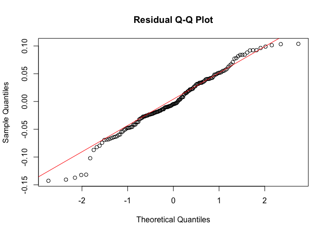

``` r
# plot residuals vs fitted values
plot(lm_e3$fitted.values, residuals(lm_e3), 
     xlab = "Fitted Values", 
     ylab = "Residuals", 
     main = "Residuals vs Fitted Values",
     pch = 20, col = "blue")

# add a horizontal line at 0 for reference
abline(h = 0, col = "red", lty = 2)
```

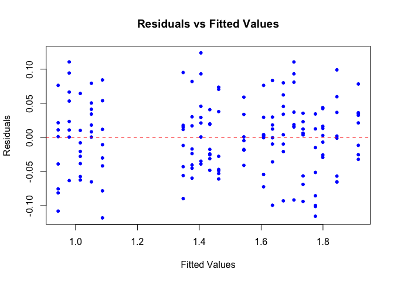

``` r
# check the model summary
summary(lm_e3)
```


    Call:
    lm(formula = L_log ~ N + M + I + N:M + I:M + I:N + M:I:N, data = dat_e3)

    Residuals:
          Min        1Q    Median        3Q       Max 
    -0.117909 -0.038519  0.002396  0.034266  0.123897 

    Coefficients:
                 Estimate Std. Error t value Pr(>|t|)    
    (Intercept)  1.497750   0.025481  58.779  < 2e-16 ***
    N            0.100172   0.008665  11.561  < 2e-16 ***
    M           -0.207229   0.036036  -5.751 4.73e-08 ***
    I           -0.081218   0.036036  -2.254   0.0256 *  
    N:M         -0.058774   0.012254  -4.796 3.82e-06 ***
    M:I         -0.050762   0.050962  -0.996   0.3208    
    N:I         -0.008102   0.012254  -0.661   0.5095    
    N:M:I       -0.084952   0.017330  -4.902 2.41e-06 ***
    ---
    Signif. codes:  0 '***' 0.001 '**' 0.01 '*' 0.05 '.' 0.1 ' ' 1

    Residual standard error: 0.05372 on 152 degrees of freedom
    Multiple R-squared:  0.971, Adjusted R-squared:  0.9696 
    F-statistic: 726.6 on 7 and 152 DF,  p-value: < 2.2e-16

The  parameter is the “N:M:I” parameter.
This output indicates that  is
significantly less than zero ()
().
Therefore, we accept our alternative hypothesis that
 is less than zero which indicates that
the competitive effect of invasives on natives increases with nitrogen
but only with microbes.

Function to bootstrap the competition estimate.

``` r
# function for bootstrapping the sample and estimating competition between natives and invasives
bootstrap_comp <- function(data, n) {
  # bootstrap the psf estimates n times
  resampled_comp <- lapply(1:n, function(i) {
    # get bootstrap indices
    indices <- sample(seq_len(nrow(data)), replace = TRUE)
    # extract the re-sampled data
    resample_i <- data[indices, ]
    # calculate psf
    suppressMessages(
      resample_i_wide <-
        resample_i |> 
        dplyr::group_by(N, M, I) |>
        dplyr::summarise(mean_L = mean(L, na.rm = TRUE)) |>
        dplyr::ungroup() |>
        tidyr::pivot_wider(id_cols = c("N", "M"),
                           names_from = "I",
                           values_from = "mean_L")
      )
   # rename the variables
   names(resample_i_wide) <- c("N", "M", "without_I", "with_I")
   # calculate competition
   resample_i_wide$competition <- with(resample_i_wide, with_I/without_I)
   # return the re-sampled data
   resample_i_wide <-
     if (any(is.na(resample_i_wide$competition))) {
       NA
       } else {
         resample_i_wide
       }
   return(resample_i_wide)
  })
  # remove the datasets with missing values
  resampled_comp <- resampled_comp[!sapply(resampled_comp, function(x) is.null(x) || (is.logical(x) && is.na(x)))]
  # return the output
  return(dplyr::bind_rows(resampled_comp, .id = "bootstrap_i"))
}
```

Plot the model results along with the bootstrapped competition metrics.

``` r
# log-scale

# get model predictions
pred_e3 <- dplyr::as_tibble(predict(lm_e3, interval = "confidence"))

# add the fit statistics to the data
plot_e3 <-
  dat_e3 |>
  dplyr::mutate(fit = pred_e3$fit,
                lwr = pred_e3$lwr,
                upr = pred_e3$upr)

# plot the data on the log-scale
p1 <-
  ggplot(data = plot_e3 |> dplyr::mutate(M = as.character(M), I = as.character(I))) +
  geom_point(mapping = aes(x = N, y = L_log, colour = I)) +
  geom_line(mapping = aes(x = N, y = fit, colour = I)) +
  geom_ribbon(mapping = aes(x = N, ymin = lwr, ymax = upr, fill = I), alpha = 0.1) +
  facet_wrap(~ M) +
  ylab("Native biomass (mg) (log-scale)") +
  xlab("log(N)") +
  theme_bw()

# calculate competition

# bootstrapped
comp_e3_boot <- bootstrap_comp(data = dat_e3, n = 1000)

# check the bootstrapped data
summary(comp_e3_boot)
```

     bootstrap_i              N               M         without_I    
     Length:9930        Min.   :1.386   Min.   :0.0   Min.   :3.576  
     Class :character   1st Qu.:2.079   1st Qu.:0.0   1st Qu.:4.136  
     Mode  :character   Median :2.773   Median :0.5   Median :4.697  
                        Mean   :2.773   Mean   :0.5   Mean   :5.013  
                        3rd Qu.:3.466   3rd Qu.:1.0   3rd Qu.:5.751  
                        Max.   :4.159   Max.   :1.0   Max.   :7.217  
         with_I       competition    
     Min.   :2.349   Min.   :0.5292  
     1st Qu.:2.775   1st Qu.:0.6680  
     Median :3.850   Median :0.8171  
     Mean   :4.057   Mean   :0.7912  
     3rd Qu.:5.392   3rd Qu.:0.8936  
     Max.   :6.310   Max.   :1.0536  

``` r
# summarise these bootstrapped samples
comp_e3_boot_sum <-
  comp_e3_boot |>
  dplyr::group_by(N) |>
  dplyr::summarise(comp_mean = mean(competition, na.rm = TRUE),
                   comp_sd = sd(competition, na.rm = TRUE))

# plot the change
p2 <-
  ggplot(data = comp_e3_boot_sum,
       mapping = aes(x = N, y = comp_mean)) +
  geom_point() +
  geom_errorbar(mapping = aes(ymin = comp_mean - comp_sd,
                              ymax = comp_mean + comp_sd),
                width = 0) +
  ylab("Competition") +
  xlab("log(N)") +
  theme_bw()

cowplot::plot_grid(p1, p2, nrow = 1, rel_widths = c(2, 1))
```

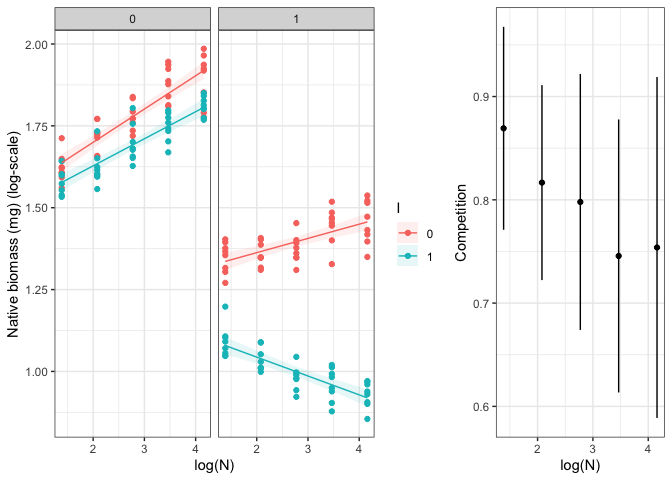
